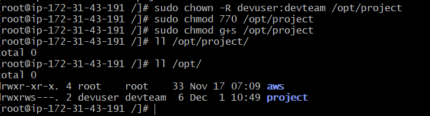
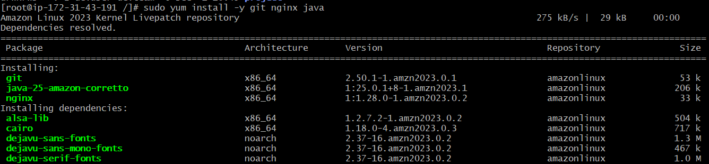
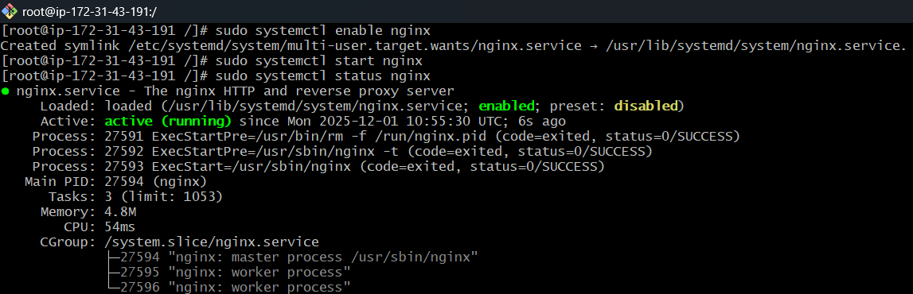
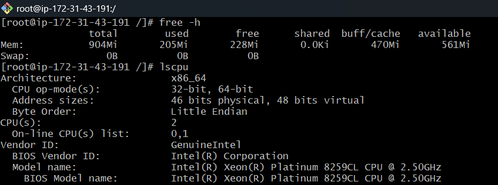
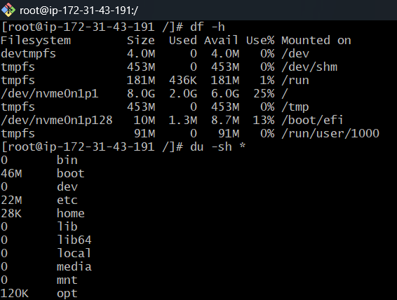
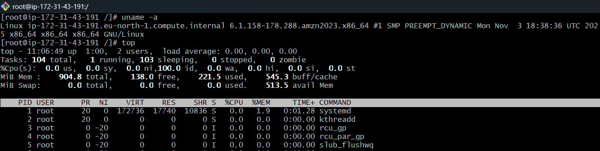

# linux-demo

## Linux Administration Skill Levels (Amazon Linux Compatible)

A structured roadmap of Linux admin skills categorized into **Basic**, **Intermediate**, and **Advanced**.

---

# 🟩 Level 1 – Basic (Foundational Skills)

### ✔️ Set up users and groups for development teams

```bash
sudo adduser devuser
sudo groupadd devteam
sudo usermod -aG devteam devuser
```


### ✔️ Manage permissions for project directories

```bash
sudo chown -R devuser:devteam /opt/project
sudo chmod 770 /opt/project
sudo chmod g+s /opt/project
```


### ✔️ Install required packages (git, nginx, java)

Amazon Linux / Amazon Linux 2:

```bash
sudo yum install -y git nginx java
```


Enable & start Nginx:

```bash
sudo systemctl enable nginx
sudo systemctl start nginx
sudo systemctl status nginx
```


### ✔️ Check system information

```bash
free -h            # memory
lscpu              # CPU details
df -h              # disk usage
du -sh *           # folder sizes
uname -a           # OS info
top                # process usage
```




Install `htop` (not preinstalled):

```bash
sudo yum install -y htop
```

---

# 🟧 Level 2 – Intermediate (Daily DevOps Tasks)

### ✔️ Automate backups using Cron jobs

Edit crontab:

```bash
crontab -e
```

Backup cron job example:

```bash
0 2 * * * tar -czf /backup/app_$(date +\%F).tar.gz /opt/app/
```

### ✔️ Create shell scripts (cleanup, restarts, health checks)

```bash
nano cleanup.sh
```

```bash
#!/bin/bash
find /var/log -type f -name "*.log" -mtime +7 -delete
```

```bash
chmod +x cleanup.sh
```

### ✔️ Manage and analyze logs under `/var/log`

Amazon Linux logs:

```bash
cd /var/log
tail -f messages
tail -f secure
tail -100 /var/log/nginx/error.log
grep -i "error" /var/log/messages
journalctl -u nginx
```

### ✔️ Monitor system performance & troubleshoot services

Tools available on Amazon Linux:

```bash
htop
vmstat 5
iostat            # install via: sudo yum install -y sysstat
systemctl status nginx
journalctl -xe
ss -tulnp         # faster than netstat
```

Install net-tools (if needed):

```bash
sudo yum install -y net-tools
```

---

# 🟥 Level 3 – Advanced (Production-Ready Linux Admin)

### ✔️ Create custom systemd services

```bash
sudo nano /etc/systemd/system/app.service
```

Example:

```ini
[Unit]
Description=MyApp Service
After=network.target

[Service]
ExecStart=/usr/bin/java -jar /opt/app/app.jar
Restart=always

[Install]
WantedBy=multi-user.target
```

Apply it:

```bash
sudo systemctl daemon-reload
sudo systemctl enable app
sudo systemctl start app
```

### ✔️ SSH hardening (compatible with Amazon Linux)

```bash
sudo nano /etc/ssh/sshd_config
```

Recommended:

```
PermitRootLogin no
PasswordAuthentication no
AllowUsers devuser
```

Apply:

```bash
sudo systemctl restart sshd
```

### ✔️ Configure and manage LVM (Amazon Linux supports LVM2)

```bash
sudo yum install -y lvm2

sudo pvcreate /dev/sdb
sudo vgcreate vgdata /dev/sdb
sudo lvcreate -L 20G -n lvapp vgdata
sudo mkfs.xfs /dev/vgdata/lvapp   # xfs is default on Amazon Linux
sudo mkdir /mnt/app
sudo mount /dev/vgdata/lvapp /mnt/app
```

### ✔️ Set up firewall rules (Amazon Linux typically uses **iptables**)

Amazon Linux 2 supports firewalld:

Install & enable:

```bash
sudo yum install -y firewalld
sudo systemctl enable firewalld
sudo systemctl start firewalld
```

Add rules:

```bash
sudo firewall-cmd --add-port=80/tcp --permanent
sudo firewall-cmd --add-port=22/tcp --permanent
sudo firewall-cmd --reload
```

If using iptables:

```bash
sudo iptables -A INPUT -p tcp --dport 22 -j ACCEPT
sudo iptables -A INPUT -p tcp --dport 80 -j ACCEPT
```

### ✔️ Implement logrotate on Amazon Linux

```bash
sudo nano /etc/logrotate.d/myapp
```

Example:

```
/opt/app/logs/*.log {
    daily
    rotate 7
    compress
    missingok
    notifempty
}
```