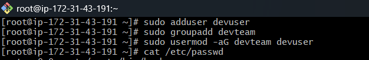
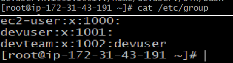

# linux-demo

## Linux Administration Skill Levels

A structured roadmap of Linux admin skills categorized into three levels: **Basic**, **Intermediate**, and **Advanced**, along with essential Linux commands for each task.

---

# 🟩 Level 1 – Basic (Foundational Skills)

### ✔️ Set up users and groups for development teams

```bash
sudo adduser devuser  
sudo groupadd devteam  
sudo usermod -aG devteam devuser 
```




### ✔️ Manage permissions for project directories

```bash
sudo chown -R devuser:devteam /opt/project  
sudo chmod 770 /opt/project  
sudo chmod g+s /opt/project    # group inheritance
```

### ✔️ Install required packages (git, nginx, java)

```bash
sudo apt update  
sudo apt install -y git nginx default-jre  
```

*RHEL/CentOS:*

```bash
sudo yum install git nginx java-11-openjdk
```

### ✔️ Check system information (memory, CPU, disk usage)

```bash
free -h              # memory  
lscpu                # CPU details  
df -h                # disk usage  
du -sh *             # folder size  
uname -a             # OS info  
top / htop           # process usage  
```

---

# 🟧 Level 2 – Intermediate (Daily DevOps Tasks)

### ✔️ Automate backups using Cron jobs

Edit cron file:

```bash
crontab -e
```

Example backup cron job:

```bash
0 2 * * * tar -czf /backup/app_$(date +\%F).tar.gz /opt/app/
```

### ✔️ Create shell scripts (log cleanup, service restart, health checks)

```bash
nano cleanup.sh
```

```bash
#!/bin/bash
find /var/log -type f -name "*.log" -mtime +7 -delete
```

```bash
chmod +x cleanup.sh
```

### ✔️ Manage and analyze logs under `/var/log`

```bash
cd /var/log  
tail -f syslog  
tail -100 nginx/error.log  
grep -i "error" /var/log/messages  
journalctl -u nginx  
```

### ✔️ Monitor system performance and troubleshoot service issues

```bash
htop  
vmstat 5  
iostat  
systemctl status nginx  
journalctl -xe  
netstat -tulnp  
ss -tulnp  
```

---

# 🟥 Level 3 – Advanced (Production-Ready Linux Admin)

### ✔️ Create custom **systemd** services for applications

Create service file:

```bash
sudo nano /etc/systemd/system/app.service
```

Example:

```ini
[Unit]
Description=MyApp Service
After=network.target

[Service]
ExecStart=/usr/bin/java -jar /opt/app/app.jar
Restart=always

[Install]
WantedBy=multi-user.target
```

Then:

```bash
sudo systemctl daemon-reload  
sudo systemctl enable app  
sudo systemctl start app  
```

### ✔️ Implement SSH hardening for security

```bash
sudo nano /etc/ssh/sshd_config
```

Recommended changes:

```
PermitRootLogin no
PasswordAuthentication no
AllowUsers devuser
```

Apply:

```bash
sudo systemctl restart sshd
```

### ✔️ Configure and manage LVM for scalable storage

```bash
pvcreate /dev/sdb  
vgcreate vgdata /dev/sdb  
lvcreate -L 20G -n lvapp vgdata  
mkfs.ext4 /dev/vgdata/lvapp  
mount /dev/vgdata/lvapp /mnt/app  
```

### ✔️ Set up firewall rules (iptables / firewalld / ufw)

**ufw:**

```bash
sudo ufw allow 22  
sudo ufw allow 80  
sudo ufw enable
```

**firewalld:**

```bash
sudo firewall-cmd --add-port=80/tcp --permanent  
sudo firewall-cmd --reload
```

### ✔️ Implement **logrotate** for application log management

Create config:

```bash
sudo nano /etc/logrotate.d/myapp
```

Example:

```
/opt/app/logs/*.log {
    daily
    rotate 7
    compress
    missingok
}
```

---